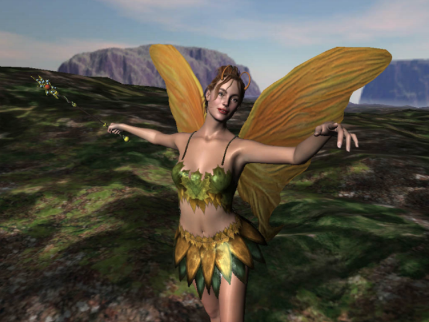
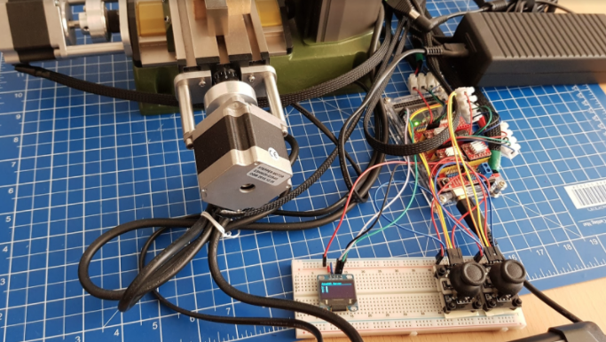
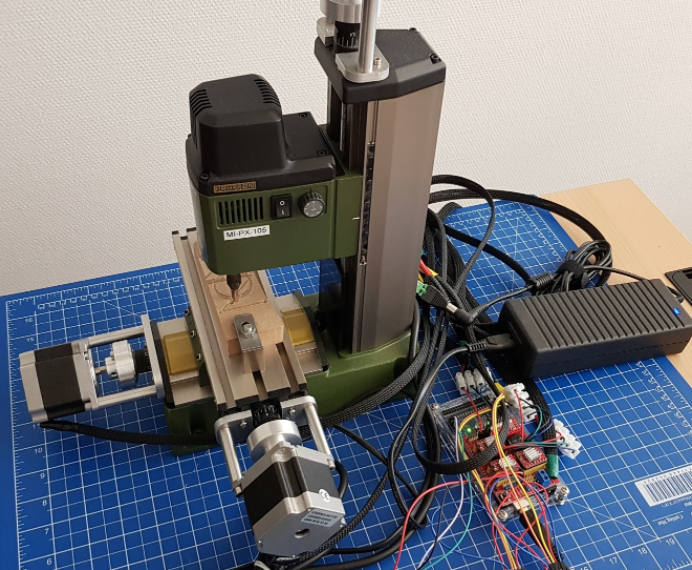
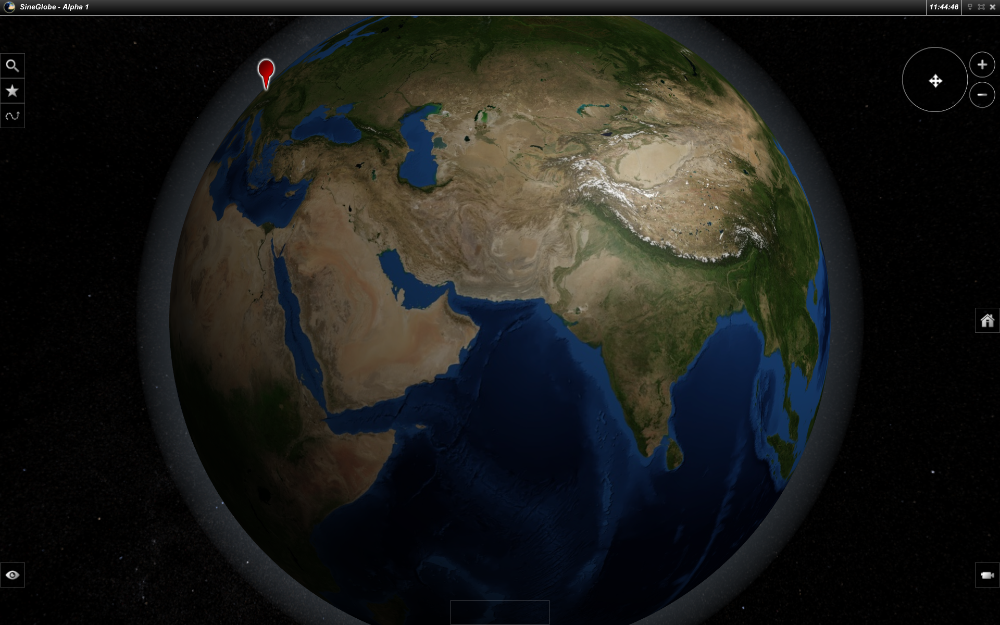
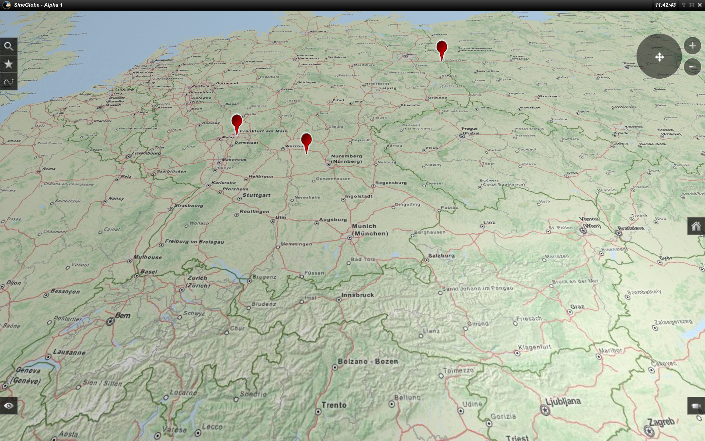
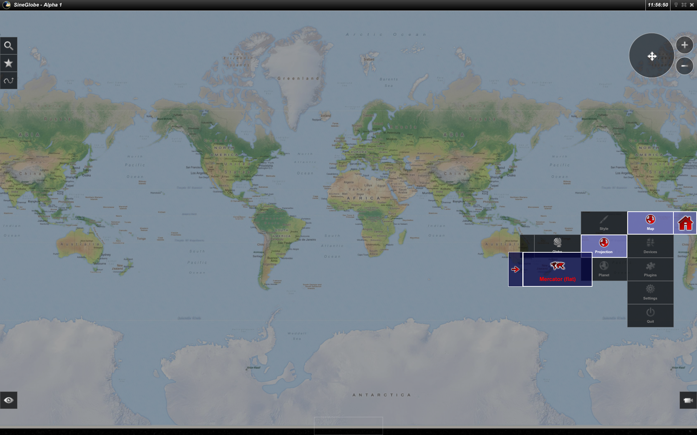
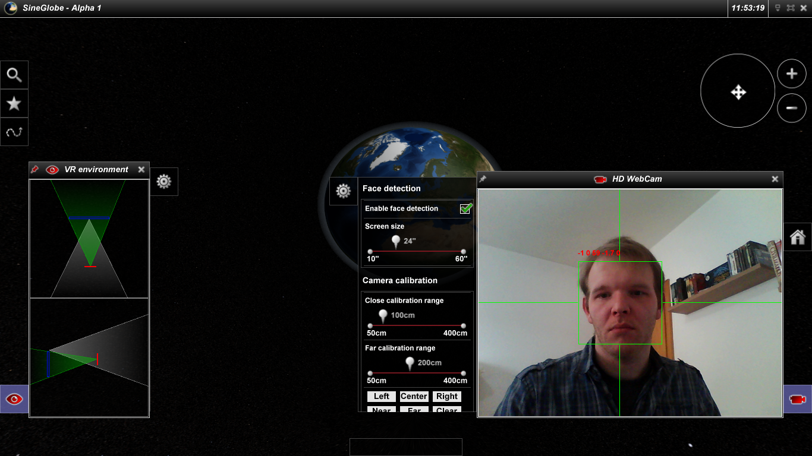

## Aphereon 2 ##

The development of Aphereon 2 started in 2002 privately with the destination to write a cutting edge 3D rendering engine making full use of the still relative new transforming and lighting technology nVidia just introduced recently which boosed the graphics power of computers by more than factor 10 in comparison to "normal" cards like the Riva TNT at this time.

Aphereon 2 meanwhile evolved to nearly 500,000 lines of code within the last 15 years to Aphereon 4 in 2017 which is used in many projects of LOGIBALL GmbH and it's customers.

## SineCNC ##

SineCNC is a (still in progress) experimental project of refactoring a manual miling machine into a stepper motor controlled CNC machine including the implementation of an own serial communication protocol and PC interface and without making any use of "ready to use" CNC solutions.

The target of this project is not to make a real fully functional CNC machine... also if it is already able to mill complete and precise circles and rectangles... but just to get a feeling for the difficulties and hurdles of robotic engineering.

## SineGlobe ##

SineGlobe was an experimental Google Earth clone with which you could render WMTS tiles of all providers such as Google, OSM and of course LOGIBALL, using the common Google Mercator projection to display a globe, search for cities or calculate a route.

After the successful private experimental phase it was transformed and evolved to the localion M solution with which you can now create great map navigation and routing solutions for iOS and Android devices. 

For more details google "LOGIBALL Localion M"

### Automatic face detection based perspective correction and holographic simulation ###
